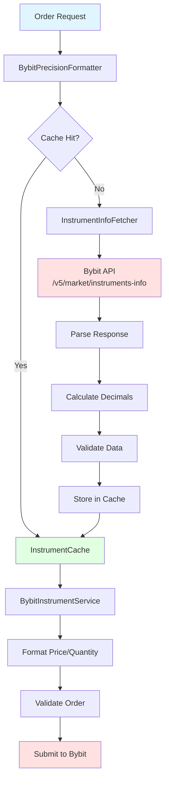
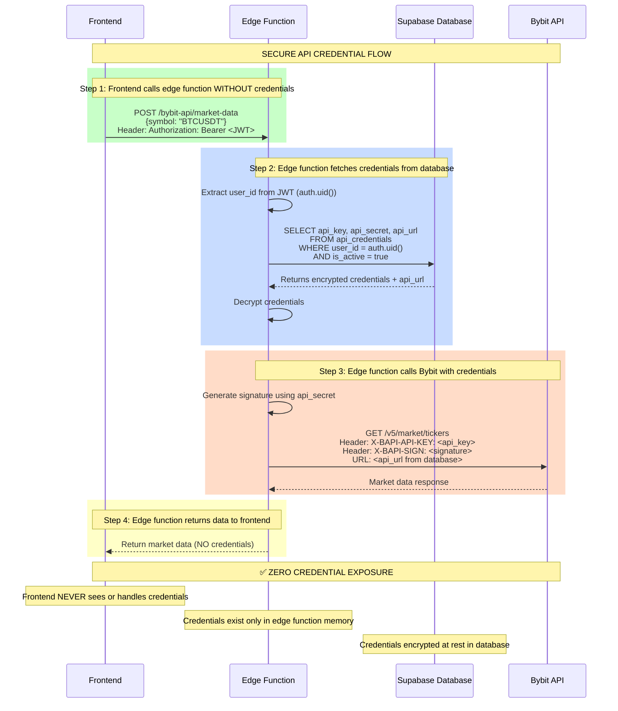
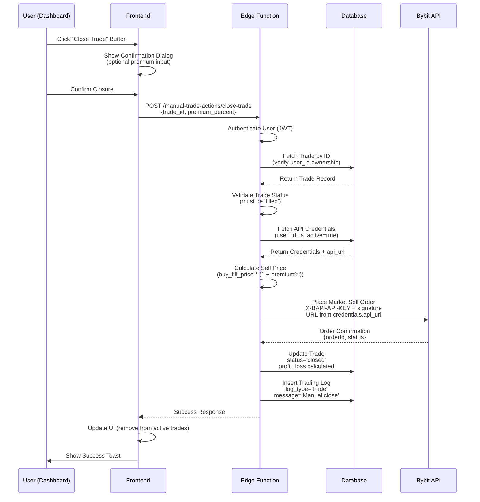
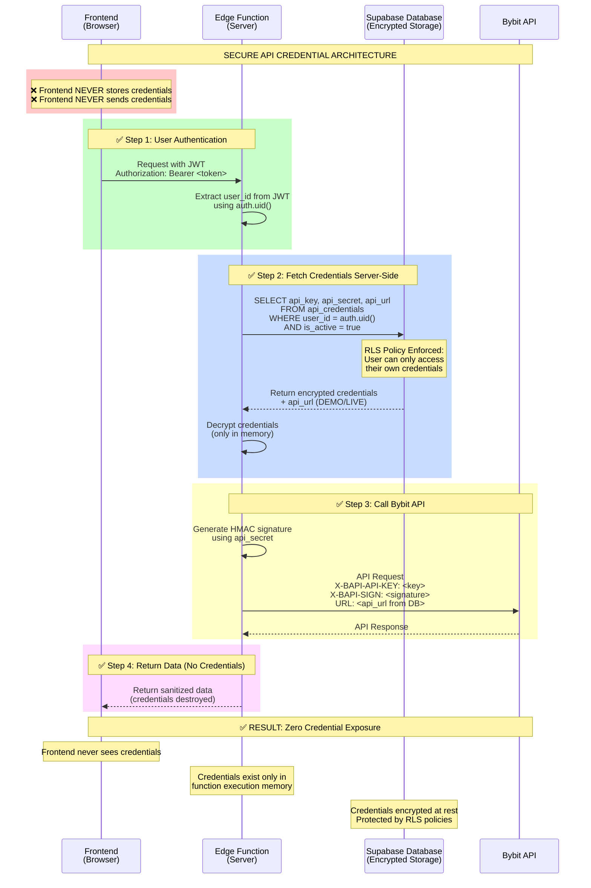
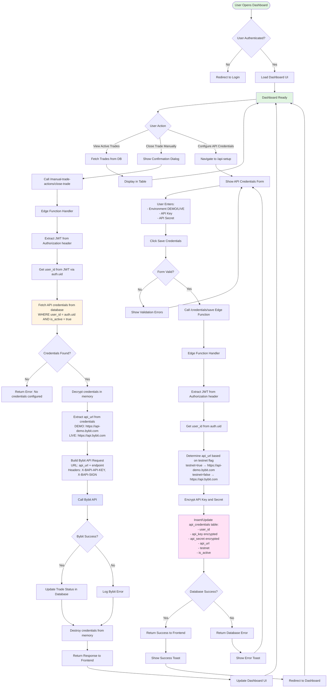

# Bybit Trading Bot - Comprehensive Product Specification

## Document Version
**Version**: 2.0  
**Last Updated**: 2025  
**Status**: Production Ready with Critical Security Architecture

---

## Table of Contents
1. [Project Overview](#1-project-overview)
2. [Core Features](#2-core-features)
3. [User Interface Requirements](#3-user-interface-requirements)
4. [Database Schema](#4-database-schema)
5. [Backend Services (Edge Functions)](#5-backend-services-edge-functions)
6. [Core Trading Services Architecture](#6-core-trading-services-architecture)
7. [Trading Flow Sequence](#7-trading-flow-sequence)
8. [Security Requirements](#8-security-requirements)
9. [Integration with Bybit](#9-integration-with-bybit)
10. [Testing & Validation](#10-testing--validation)
11. [UI/UX Requirements](#11-uiux-requirements)
12. [Deployment Considerations](#12-deployment-considerations)
13. [Key Technical Concepts](#13-key-technical-concepts)
14. [Tech Stack Summary](#14-tech-stack-summary)
15. [Example User Flow](#15-example-user-flow)
16. [Quick Start Prompt for Lovable](#16-quick-start-prompt-for-lovable)
17. [Additional Security Best Practices](#17-additional-security-best-practices)

---

## 1. Project Overview

### 1.1 Purpose
An automated cryptocurrency trading bot that operates on **Bybit's DEMO trading environment** (virtual funds) with support for switching to LIVE trading. The bot uses configurable trading logic to identify support levels, execute trades, and manage positions automatically.

### 1.2 Key Objectives
- **Automated Trading**: Execute trades based on configurable support level detection algorithms
- **Risk Management**: Enforce position limits, exposure caps, and profit targets
- **Real-Time Monitoring**: Live dashboard showing active trades, P&L, and system status
- **Flexibility**: Two trading logic variants with extensive configuration options
- **Security**: Zero client-side credential exposure with server-side credential management
- **Testing**: Comprehensive validation suite for API, orders, and trading logic

### 1.3 Target Environment
- **Primary**: Bybit DEMO API (`https://api-demo.bybit.com`) - Virtual funds for testing
- **Secondary**: Bybit LIVE API (`https://api.bybit.com`) - Real funds (user-controlled toggle)
- **Market**: Spot trading pairs (e.g., BTCUSDT, ETHUSDT, SOLUSDT)
- **Account Type**: Unified Trading Account (UTA)

---

## 2. Core Features

### 2.1 Automated Trading Engine
- **Main Loop**: Configurable interval (default 30 seconds, adjustable 1s - 1 hour)
- **Signal Generation**: Two configurable logic systems:
  - **Logic 1**: Base Support Detection (simpler, faster)
  - **Logic 2**: Data-Driven Support Analysis (advanced, multiple indicators)
- **Order Execution**: Real Bybit API limit buy orders with automatic take-profit sells
- **Position Monitoring**: Real-time order fill checking and profit tracking

### 2.2 Trading Logic Variants

#### Logic 1: Base Support Detection
```
- Uses simple candlestick analysis
- Configurable candle count lookback (default: 128)
- Support threshold: X% below current price
- New position trigger: Price drops Y% from existing position
- Fast execution, lower confidence scores
```

#### Logic 2: Data-Driven Support Analysis
```
- Multi-indicator approach:
  - ATR (Average True Range) for volatility
  - Fibonacci retracement levels
  - Swing high/low analysis
  - Volume profile validation
- Higher confidence scores
- More conservative entry points
- Better suited for volatile markets
```

### 2.3 Position & Risk Management
- **Max Active Pairs**: Limit total number of trading pairs (default: 20)
- **Max Positions Per Pair**: Prevent overexposure to single symbol (default: 2)
- **Portfolio Exposure**: Cap total capital at risk (default: 20%)
- **Order Size Limits**: Maximum USD per order (default: $50)
- **Dynamic Precision**: Symbol-specific price/quantity formatting

### 2.4 End-of-Day (EOD) Management
- **Profit-Only Closure**: Automatically close profitable positions at EOD
- **Loss Protection**: Keep losing trades open to continue next day
- **Configurable Time**: Set daily cutoff time (default: 23:00 UTC)
- **Premium Pricing**: Optional sell premium on EOD closes (default: 0.1%)

### 2.5 Manual Trade Management
- **Manual Close**: Close any position manually via dashboard
- **Premium Override**: Custom sell premium for manual closes
- **Bulk Actions**: Close multiple positions simultaneously
- **Position History**: View all closed trades with P&L breakdown

### 2.6 Dynamic Precision Management

#### 2.6.1 Problem Statement
Cryptocurrency trading pairs on Bybit have vastly different precision requirements that cannot be hardcoded:

| Symbol | Price Precision | Quantity Precision | Min Order Value |
|--------|----------------|-------------------|-----------------|
| BTCUSDT | 2 decimals | 6 decimals | $10-25 USD |
| DOGEUSDT | 5 decimals | 0-1 decimals | $5-15 USD |
| ETHUSDT | 2 decimals | 5 decimals | $10-25 USD |

**Consequences of incorrect precision:**
- ❌ Orders rejected by exchange API
- ❌ "Invalid price" or "Invalid quantity" errors
- ❌ Wasted API calls and rate limit consumption
- ❌ Failed trades and lost opportunities

**Solution:** Dynamic fetching and caching of precision rules from Bybit for each symbol.

#### 2.6.2 Bybit API Integration

**Endpoint:** `GET /v5/market/instruments-info`

**Request Parameters:**
```typescript
{
  category: "spot",
  symbol: "BTCUSDT"  // Can fetch single or multiple symbols
}
```

**Response Structure (Critical Fields):**
```typescript
{
  retCode: 0,
  result: {
    list: [{
      symbol: "BTCUSDT",
      
      // Price precision
      priceFilter: {
        tickSize: "0.01",      // Minimum price increment
        minPrice: "0.01",
        maxPrice: "99999.99"
      },
      
      // Quantity precision  
      lotSizeFilter: {
        basePrecision: "0.000001",  // Minimum quantity increment
        minOrderQty: "0.000048",    // Minimum order quantity
        maxOrderQty: "71.73956243",
        minOrderAmt: "1"            // Minimum order value in USD
      }
    }]
  }
}
```

**Key Fields Mapping:**
- `tickSize` → Price decimal places (e.g., "0.01" = 2 decimals)
- `basePrecision` → Quantity decimal places (e.g., "0.000001" = 6 decimals)
- `minOrderQty` → Minimum tradeable quantity
- `minOrderAmt` → Minimum order value in quote currency (USD)

#### 2.6.3 Decimal Calculation Logic

**Price Decimals (from tickSize):**
```typescript
// Example: tickSize = "0.01"
// Step 1: Convert to number: 0.01
// Step 2: Count decimals after decimal point: 2
// Result: priceDecimals = 2

function calculateDecimalsFromTickSize(tickSize: string): number {
  const num = parseFloat(tickSize);
  const fixedStr = num.toFixed(20);  // Expand to capture all decimals
  const dotIndex = fixedStr.indexOf('.');
  
  if (dotIndex === -1) return 0;
  
  // Count non-zero decimals from right
  let decimals = 0;
  for (let i = fixedStr.length - 1; i > dotIndex; i--) {
    if (fixedStr[i] !== '0') {
      decimals = i - dotIndex;
      break;
    }
  }
  
  return Math.min(decimals, 8);  // Cap at 8 (Bybit max)
}
```

**Quantity Decimals (from basePrecision):**
```typescript
// Example: basePrecision = "0.000001"  
// Result: quantityDecimals = 6

// Same logic as price decimals
function calculateDecimalsFromBasePrecision(basePrecision: string): number {
  return calculateDecimalsFromTickSize(basePrecision);
}
```

**Formatting Examples:**
```typescript
// BTCUSDT
formatPrice("BTCUSDT", 45678.123456)  // → "45678.12" (2 decimals)
formatQuantity("BTCUSDT", 0.123456789) // → "0.123457" (6 decimals)

// DOGEUSDT
formatPrice("DOGEUSDT", 0.123456)     // → "0.12346" (5 decimals)
formatQuantity("DOGEUSDT", 1000.567)  // → "1001" (0 decimals)
```

#### 2.6.4 Caching Architecture

**Cache Implementation:**
```typescript
// src/services/trading/core/InstrumentCache.ts
class InstrumentCache {
  private static cache = new Map<string, CachedInstrument>();
  private static readonly TTL = 24 * 60 * 60 * 1000;  // 24 hours
  private static readonly MAX_SIZE = 100;              // Prevent memory leaks
  
  interface CachedInstrument {
    data: BybitInstrumentInfo;
    timestamp: number;
  }
}
```

**Cache Flow:**
```
1. Check cache for symbol
   ↓
2. If found AND not expired (< 24h old)
   → Return cached data
   ↓
3. If missing OR expired
   → Fetch from Bybit API
   → Store in cache with timestamp
   → Return fresh data
```

**LRU Eviction:**
When cache exceeds 100 symbols, oldest entries are automatically removed to prevent memory leaks.

**Cache Invalidation:**
- Manual: `InstrumentCache.clearCache()`
- Automatic: Entries expire after 24 hours
- On Error: Failed fetches don't cache, retry next time

#### 2.6.5 Service Layer Architecture

**Flow Diagram:**



**Service Responsibilities:**

1. **InstrumentInfoFetcher** (`src/services/trading/core/InstrumentInfoFetcher.ts`)
   - Fetches raw instrument data from Bybit API
   - Handles API errors and retries
   - Parses Bybit response structure
   - Calculates decimal places from `tickSize` and `basePrecision`
   - Validates fetched data integrity

2. **InstrumentCache** (`src/services/trading/core/InstrumentCache.ts`)
   - Stores instrument info with TTL (24 hours)
   - Implements LRU eviction (max 100 entries)
   - Provides cache statistics and cleanup
   - Thread-safe for concurrent access

3. **BybitInstrumentService** (`src/services/trading/core/BybitInstrumentService.ts`)
   - High-level API for instrument operations
   - Coordinates fetcher and cache
   - Provides formatting functions
   - Validates orders against instrument rules
   - Supports batch operations for multiple symbols

4. **BybitPrecisionFormatter** (`src/services/trading/core/BybitPrecisionFormatter.ts`)
   - Main entry point for precision operations
   - Delegates to BybitInstrumentService
   - Used throughout trading system
   - Provides unified interface

**Type Definition:**
```typescript
export type BybitInstrumentInfo = {
  symbol: string;
  priceDecimals: number;      // Calculated from tickSize
  quantityDecimals: number;   // Calculated from basePrecision
  minOrderQty: string;        // From lotSizeFilter
  minOrderAmt: string;        // From lotSizeFilter
  tickSize: string;           // From priceFilter
  basePrecision: string;      // From lotSizeFilter
};
```

#### 2.6.6 Error Handling and Fallbacks

**Graceful Degradation Strategy:**

1. **Primary**: Fetch from Bybit API
2. **Fallback 1**: Use cached data (even if expired)
3. **Fallback 2**: Use reasonable defaults (4 decimals for both)

```typescript
async formatPrice(symbol: string, price: number): Promise<string> {
  try {
    // Try to get instrument info
    const info = await BybitInstrumentService.getInstrumentInfo(symbol);
    if (info) {
      return formatWithPrecision(price, info.priceDecimals);
    }
    
    // Fallback 1: Warn and use default
    console.warn(`No instrument info for ${symbol}, using 4 decimal fallback`);
    return price.toFixed(4);
    
  } catch (error) {
    // Fallback 2: Error fallback
    console.error(`Error formatting ${symbol}:`, error);
    return price.toFixed(4);
  }
}
```

**Error Scenarios Handled:**
- Network failures fetching from Bybit
- Invalid API responses
- Missing instrument data
- Parsing errors in tickSize/basePrecision
- Rate limiting from Bybit API

**Logging Strategy:**
- ✅ Success: Quiet (no spam)
- ⚠️ Fallback: Warning with reason
- ❌ Error: Full error with context

#### 2.6.7 Batch Operations

**Optimization for Multiple Symbols:**
```typescript
// Fetch multiple symbols in parallel
const symbols = ['BTCUSDT', 'ETHUSDT', 'SOLUSDT'];
const instrumentMap = await BybitInstrumentService.getMultipleInstrumentInfo(symbols);

// Use cached results for all subsequent operations
for (const [symbol, info] of instrumentMap) {
  const price = formatPrice(symbol, currentPrice, info);
  const qty = formatQuantity(symbol, orderQty, info);
}
```

**Benefits:**
- Reduces API calls (1 call vs N calls)
- Parallel fetching for speed
- Shared cache warming
- Lower rate limit consumption

#### 2.6.8 Example Precision Ranges

**Real-World Symbol Precision (as of 2025):**

| Symbol | Price Decimals | Qty Decimals | Min Order Qty | Min Order Value |
|--------|---------------|--------------|---------------|-----------------|
| BTCUSDT | 2 | 6 | 0.000048 | $1 |
| ETHUSDT | 2 | 5 | 0.00046 | $1 |
| SOLUSDT | 3 | 2 | 0.04 | $1 |
| BNBUSDT | 2 | 3 | 0.0016 | $1 |
| DOGEUSDT | 5 | 0 | 1 | $1 |
| XRPUSDT | 4 | 1 | 0.1 | $1 |
| ADAUSDT | 4 | 0 | 1 | $1 |
| MATICUSDT | 4 | 0 | 1 | $1 |

**Why Dynamic Fetching is Critical:**
- These values change over time (Bybit updates)
- New symbols have different rules
- Hardcoding would require constant maintenance
- API provides source of truth

#### 2.6.9 Integration Points

**Used Throughout Trading System:**

1. **Order Placement** (`src/services/trading/core/OrderExecution.ts`)
   ```typescript
   const formattedPrice = await BybitPrecisionFormatter.formatPrice(symbol, price);
   const formattedQty = await BybitPrecisionFormatter.formatQuantity(symbol, qty);
   ```

2. **Order Validation** (`src/services/trading/core/OrderValidation.ts`)
   ```typescript
   const isValid = await BybitPrecisionFormatter.validateOrder(symbol, price, qty);
   ```

3. **Quantity Calculation** (`src/services/trading/tradeValidation.ts`)
   ```typescript
   const qty = await BybitPrecisionFormatter.calculateQuantity(symbol, orderAmount, price);
   ```

4. **Display Formatting** (UI components)
   ```typescript
   const displayPrice = await BybitInstrumentService.formatPrice(symbol, price);
   ```

#### 2.6.10 Code References

**Core Files:**
- `src/services/trading/core/InstrumentInfoFetcher.ts` - Bybit API fetching
- `src/services/trading/core/InstrumentCache.ts` - Caching layer
- `src/services/trading/core/BybitInstrumentService.ts` - Service orchestration
- `src/services/trading/core/BybitPrecisionFormatter.ts` - Main interface
- `src/services/trading/core/precision/PriceFormatter.ts` - Price formatting logic
- `src/services/trading/core/precision/QuantityFormatter.ts` - Quantity formatting logic
- `src/services/trading/core/precision/OrderValidator.ts` - Order validation

**Related Services:**
- `src/services/trading/tradeValidation.ts` - Uses precision for trade validation
- `src/services/trading/core/OrderExecution.ts` - Uses precision before API calls
- `src/components/trading/TestOrderPlacer.tsx` - UI testing of precision

**Testing:**
- Precision tested in `TradingSystemTest` component
- Instrument info fetch tested in system validation
- Order validation includes precision checks

### 2.7 Real-Time Dashboard
- **Active Trades Table**: Live updates of all open positions
- **P&L Tracking**: Real-time profit/loss calculations
- **Trading Stats**: Win rate, total profit, average profit per trade
- **System Status**: Engine running state, last loop execution time
- **Quick Actions**: Start/stop engine, manual close buttons

---

## 3. User Interface Requirements

### 3.1 Dashboard (`/` route)
**Components:**
- **Header**: 
  - User profile dropdown (top-right)
  - Trading engine status indicator (running/stopped)
  - Start/Stop engine button
  
- **Trading Stats Cards** (Top Row):
  - Total Profit/Loss (USD + percentage)
  - Active Positions count
  - Win Rate percentage
  - Average Profit per trade

- **Active Trades Table** (Main Section):
  - Columns: Symbol, Entry Price, Current Price, Quantity, P&L (USD), P&L (%), Status, Actions
  - Real-time price updates (every 5 seconds)
  - Color-coded P&L (green for profit, red for loss)
  - Manual close button per row
  - Sortable columns
  - Responsive design (mobile: cards, desktop: table)

- **Quick Stats Summary** (Bottom):
  - Total open positions by pair
  - Portfolio exposure percentage
  - Last engine execution timestamp

### 3.2 Trading Configuration (`/config` route)
**Tab-Based Interface:**

#### Tab 1: System Configuration
- **Main Loop Interval**: Slider (1-3600 seconds) with numeric input
- **Chart Timeframe**: Dropdown (1m, 5m, 15m, 1h, 4h)
- **Trading Logic Selection**: Radio buttons (Logic 1 vs Logic 2)
- **Active Status**: Toggle switch to enable/disable config

#### Tab 2: Trading Pairs Selection
- **Multi-select Dropdown**: 
  - Search functionality
  - Select/deselect all
  - Popular pairs section (BTC, ETH, SOL, etc.)
  - Maximum 50 pairs selectable
- **Selected Pairs Preview**: Chips/badges showing active pairs with remove option

#### Tab 3: Trading Logic Parameters
**For Logic 1 (Base Support Detection):**
- Support Candle Count (integer input, default 128)
- Support Lower Bound % (decimal input, default 1.0)
- Support Upper Bound % (decimal input, default 3.0)

**For Logic 2 (Data-Driven Support Analysis):**
- ATR Multiplier (decimal input, default 1.5)
- Fibonacci Sensitivity (decimal input, default 0.618)
- Swing Analysis Bars (integer input, default 50)
- Volume Lookback Periods (integer input, default 20)

#### Tab 4: Entry & Exit Configuration
- **Take Profit %**: Decimal input (default 1.0%)
- **Entry Offset %**: Decimal input (default 0.5%)
- **New Support Threshold %**: Decimal input (default 1.0%)

#### Tab 5: Position Management
- **Max Active Pairs**: Integer input (default 20)
- **Max Positions Per Pair**: Integer input (default 2)
- **Max Order Amount USD**: Decimal input (default 50.00)
- **Max Portfolio Exposure %**: Decimal input (default 20.0%)
- **Max Drawdown %**: Decimal input (default 10.0%)

#### Tab 6: End-of-Day Management
- **Auto Close at EOD**: Toggle switch
- **Daily Reset Time**: Time picker (default 23:00 UTC)
- **EOD Close Premium %**: Decimal input (default 0.1%)
- **Manual Close Premium %**: Decimal input (default 0.1%)

#### Tab 7: Notes
- **Configuration Notes**: Textarea for user notes about this configuration
- Auto-save on blur
- Character limit: 2000

**Actions:**
- Save Configuration button (primary, bottom-right)
- Reset to Defaults button (secondary)
- Success/error toast notifications
- Form validation with inline error messages

### 3.3 API Credentials Management (`/api-setup` route)
**CRITICAL SECURITY PAGE - Detailed Requirements:**

#### Page Structure
```
Header: "Bybit API Credentials Setup"
Subtitle: "Configure your API credentials for automated trading"

Security Notice (Alert Component):
"🔒 Your API credentials are encrypted and stored securely. They are NEVER exposed to the browser or frontend code."
```

#### Form Fields
1. **Environment Selection** (CRITICAL):
   ```
   Radio Button Group:
   ○ DEMO Trading (Virtual Funds) - Recommended for Testing
   ○ LIVE Trading (Real Funds) - Use with Caution
   
   Helper text:
   - DEMO: "Uses Bybit's testnet with virtual funds. Perfect for testing strategies."
   - LIVE: "⚠️ WARNING: Uses real funds. Only enable after thorough testing in DEMO mode."
   
   State management:
   - Default: DEMO
   - Stores boolean in database: testnet = true (DEMO) or false (LIVE)
   - Updates api_url automatically: 
     - DEMO: https://api-demo.bybit.com
     - LIVE: https://api.bybit.com
   ```

2. **API Key** (Text Input):
   ```
   Label: "API Key"
   Placeholder: "Enter your Bybit API key"
   Type: password (with show/hide toggle icon)
   Validation: Required, min 20 characters
   ```

3. **API Secret** (Text Input):
   ```
   Label: "API Secret"
   Placeholder: "Enter your Bybit API secret"
   Type: password (with show/hide toggle icon)
   Validation: Required, min 20 characters
   ```

4. **Active Status** (Switch):
   ```
   Label: "Enable API Credentials"
   Description: "Toggle to activate/deactivate these credentials"
   Default: true
   ```

#### Information Panel (Right Side or Below Form)
```
"How to Get Your API Credentials"

For DEMO Trading:
1. Visit https://testnet.bybit.com
2. Sign up for a free testnet account
3. Navigate to API Management
4. Create new API key with permissions:
   - Read-Write for Spot Trading
   - Read-Only for Wallet
5. Copy both API Key and Secret

For LIVE Trading:
1. Visit https://www.bybit.com
2. Log into your verified account
3. Navigate to API Management (under Account & Security)
4. Create new API key with IP whitelist (recommended)
5. Set permissions carefully (minimum required):
   - Spot Trading (Read & Write)
   - Wallet (Read Only)
6. ⚠️ NEVER share your API secret

Important Notes:
• DEMO credentials work only with DEMO environment
• LIVE credentials work only with LIVE environment
• Mixing credentials and environments will fail
• Test thoroughly in DEMO before going LIVE
```

#### Actions
- **Test Connection** button (secondary, left):
  ```
  - Calls edge function to validate credentials
  - Shows loading spinner during test
  - Success: Green toast with "✓ Connection successful!"
  - Error: Red toast with specific error message
  - Tests:
    1. API key format validity
    2. Connection to correct Bybit endpoint (DEMO/LIVE)
    3. Authentication success
    4. Account balance retrieval (read permission)
  ```

- **Save Credentials** button (primary, right):
  ```
  - Validates all fields
  - Encrypts credentials
  - Stores in database with:
    - api_key (encrypted)
    - api_secret (encrypted)
    - api_url (based on testnet boolean)
    - testnet (boolean)
    - exchange_name: "bybit"
    - user_id (from auth context)
  - Success: Green toast + redirect to dashboard
  - Error: Red toast with validation errors
  ```

#### Database Flow (SECURE)
```
Frontend → Edge Function:
  POST /credentials/save
  Body: {
    api_key: string,
    api_secret: string,
    testnet: boolean,
    is_active: boolean
  }
  Headers: { Authorization: Bearer <supabase-jwt> }

Edge Function Processing:
  1. Extract user_id from JWT (auth.uid())
  2. Determine api_url based on testnet flag
  3. Insert/update api_credentials table:
     {
       user_id: auth.uid(),
       api_key: encrypted(api_key),
       api_secret: encrypted(api_secret),
       api_url: testnet ? "https://api-demo.bybit.com" : "https://api.bybit.com",
       testnet: testnet,
       exchange_name: "bybit",
       is_active: is_active
     }
  4. Return success/error

Frontend → NEVER stores credentials
Frontend → NEVER sends credentials with trading requests
```

#### Security Indicators
- Lock icon (🔒) next to each password field
- "Secure Connection" badge in header
- Last updated timestamp
- "Credentials encrypted at rest" footer text

#### Edge Cases
- **No credentials saved**: Show empty state with "Get Started" CTA
- **Multiple credential sets**: Allow switching between DEMO/LIVE (radio selection loads respective credentials)
- **Expired credentials**: Show warning banner with "Update Credentials" button
- **Failed validation**: Inline error messages under each field

### 3.4 Trading Reports (`/reports` route)
**Filter Section:**
- Date Range Picker (start date, end date)
- Symbol Filter (multi-select dropdown)
- Status Filter (All, Closed, Profitable, Loss)
- Apply Filters button

**Report Table:**
- Columns: Date, Symbol, Entry Price, Exit Price, Quantity, P&L (USD), P&L (%), Duration
- Export to CSV button (top-right)
- Pagination (20 rows per page)
- Summary row (total P&L, avg P&L, total trades)

### 3.5 Trading Logs (`/logs` route)
**Log Viewer:**
- Real-time log stream (WebSocket or polling every 5s)
- Log level filter (All, Info, Warning, Error)
- Search/filter by keyword
- Auto-scroll toggle
- Clear logs button
- Export logs button

**Log Entry Format:**
```
[TIMESTAMP] [LEVEL] [TYPE] - Message
  └─ Additional Data (collapsible JSON viewer)
```

### 3.6 System Validation & Testing (`/test` route)
**Test Categories:**

1. **API Credentials Test**
   - Test Bybit connection
   - Verify authentication
   - Check account balance
   - Status: ✓ Pass / ✗ Fail / ⏳ Running

2. **Bybit API Test**
   - Test market data fetching
   - Test order placement (testnet)
   - Test order cancellation
   - Status indicators

3. **Trading Config Test**
   - Validate configuration values
   - Check for conflicts
   - Verify symbol availability
   - Status indicators

4. **Signal Generation Test**
   - Run signal analysis on test symbols
   - Verify support level detection
   - Check confidence scoring
   - Status indicators

5. **Order Execution Test** (DEMO only)
   - Place test limit order
   - Verify order status
   - Cancel test order
   - Status indicators

**Actions:**
- Run All Tests button (primary)
- Run Individual Test buttons (per category)
- Test Results Summary (pass/fail counts)
- Detailed error logs (expandable)

---

## 4. Database Schema

### 4.1 `trading_configs` Table
```sql
CREATE TABLE public.trading_configs (
  id UUID PRIMARY KEY DEFAULT gen_random_uuid(),
  user_id UUID NOT NULL REFERENCES auth.users(id) ON DELETE CASCADE,
  
  -- System Configuration
  main_loop_interval_seconds INTEGER DEFAULT 30,
  chart_timeframe TEXT DEFAULT '15m',
  trading_logic_type TEXT DEFAULT 'base_support_detection',
  is_active BOOLEAN DEFAULT true,
  
  -- Trading Pairs
  trading_pairs TEXT[] DEFAULT ARRAY['BTCUSDT', 'ETHUSDT']::TEXT[],
  
  -- Logic 1 Parameters (Base Support Detection)
  support_candle_count INTEGER DEFAULT 128,
  support_lower_bound_percent DECIMAL(5,2) DEFAULT 1.0,
  support_upper_bound_percent DECIMAL(5,2) DEFAULT 3.0,
  
  -- Logic 2 Parameters (Data-Driven Support Analysis)
  atr_multiplier DECIMAL(5,2) DEFAULT 1.5,
  fibonacci_sensitivity DECIMAL(5,3) DEFAULT 0.618,
  swing_analysis_bars INTEGER DEFAULT 50,
  volume_lookback_periods INTEGER DEFAULT 20,
  
  -- Entry & Exit Configuration
  take_profit_percent DECIMAL(5,2) DEFAULT 1.0,
  entry_offset_percent DECIMAL(5,2) DEFAULT 0.5,
  new_support_threshold_percent DECIMAL(5,2) DEFAULT 1.0,
  
  -- Position Management
  max_active_pairs INTEGER DEFAULT 20,
  max_positions_per_pair INTEGER DEFAULT 2,
  max_order_amount_usd DECIMAL(10,2) DEFAULT 50.00,
  max_portfolio_exposure_percent DECIMAL(5,2) DEFAULT 20.0,
  max_drawdown_percent DECIMAL(5,2) DEFAULT 10.0,
  
  -- End-of-Day Management
  auto_close_at_end_of_day BOOLEAN DEFAULT false,
  daily_reset_time TIME DEFAULT '23:00:00',
  eod_close_premium_percent DECIMAL(5,2) DEFAULT 0.1,
  manual_close_premium_percent DECIMAL(5,2) DEFAULT 0.1,
  
  -- Symbol-Specific Precision (JSON)
  price_decimals_per_symbol JSONB DEFAULT '{}'::JSONB,
  quantity_decimals_per_symbol JSONB DEFAULT '{}'::JSONB,
  quantity_increment_per_symbol JSONB DEFAULT '{}'::JSONB,
  minimum_notional_per_symbol JSONB DEFAULT '{}'::JSONB,
  
  -- Notes
  notes TEXT,
  
  -- Timestamps
  created_at TIMESTAMPTZ DEFAULT NOW(),
  updated_at TIMESTAMPTZ DEFAULT NOW(),
  
  -- Constraints
  CONSTRAINT valid_loop_interval CHECK (main_loop_interval_seconds BETWEEN 1 AND 3600),
  CONSTRAINT valid_max_pairs CHECK (max_active_pairs BETWEEN 1 AND 100),
  CONSTRAINT valid_max_positions CHECK (max_positions_per_pair BETWEEN 1 AND 10),
  CONSTRAINT unique_active_config UNIQUE (user_id, is_active) WHERE is_active = true
);

-- Enable RLS
ALTER TABLE public.trading_configs ENABLE ROW LEVEL SECURITY;

-- RLS Policies
CREATE POLICY "Users can view own trading configs"
  ON public.trading_configs FOR SELECT
  USING (auth.uid() = user_id);

CREATE POLICY "Users can create own trading configs"
  ON public.trading_configs FOR INSERT
  WITH CHECK (auth.uid() = user_id);

CREATE POLICY "Users can update own trading configs"
  ON public.trading_configs FOR UPDATE
  USING (auth.uid() = user_id);

CREATE POLICY "Users can delete own trading configs"
  ON public.trading_configs FOR DELETE
  USING (auth.uid() = user_id);

-- Indexes
CREATE INDEX idx_trading_configs_user_active ON public.trading_configs(user_id, is_active);
CREATE INDEX idx_trading_configs_updated ON public.trading_configs(updated_at DESC);

-- Trigger for updated_at
CREATE TRIGGER update_trading_configs_updated_at
  BEFORE UPDATE ON public.trading_configs
  FOR EACH ROW
  EXECUTE FUNCTION update_updated_at_column();
```

### 4.2 `api_credentials` Table
```sql
CREATE TABLE public.api_credentials (
  id UUID PRIMARY KEY DEFAULT gen_random_uuid(),
  user_id UUID NOT NULL REFERENCES auth.users(id) ON DELETE CASCADE,
  exchange_name TEXT NOT NULL DEFAULT 'bybit',
  
  -- CRITICAL: Encrypted credentials (encrypted at rest by Supabase)
  api_key TEXT NOT NULL,
  api_secret TEXT NOT NULL,
  
  -- CRITICAL: Environment configuration
  api_url TEXT NOT NULL, -- 'https://api-demo.bybit.com' or 'https://api.bybit.com'
  testnet BOOLEAN DEFAULT true, -- true = DEMO, false = LIVE
  
  -- Status
  is_active BOOLEAN DEFAULT true,
  
  -- Timestamps
  created_at TIMESTAMPTZ DEFAULT NOW(),
  updated_at TIMESTAMPTZ DEFAULT NOW(),
  
  -- Constraints
  CONSTRAINT valid_exchange CHECK (exchange_name IN ('bybit')),
  CONSTRAINT valid_api_url CHECK (api_url IN ('https://api-demo.bybit.com', 'https://api.bybit.com')),
  CONSTRAINT unique_active_credential UNIQUE (user_id, exchange_name, is_active) WHERE is_active = true
);

-- Enable RLS (CRITICAL FOR SECURITY)
ALTER TABLE public.api_credentials ENABLE ROW LEVEL SECURITY;

-- RLS Policies (CRITICAL: Ensure users can only access their own credentials)
CREATE POLICY "Users can view own API credentials"
  ON public.api_credentials FOR SELECT
  USING (auth.uid() = user_id);

CREATE POLICY "Users can create own API credentials"
  ON public.api_credentials FOR INSERT
  WITH CHECK (auth.uid() = user_id);

CREATE POLICY "Users can update own API credentials"
  ON public.api_credentials FOR UPDATE
  USING (auth.uid() = user_id);

CREATE POLICY "Users can delete own API credentials"
  ON public.api_credentials FOR DELETE
  USING (auth.uid() = user_id);

-- Indexes
CREATE INDEX idx_api_credentials_user_active ON public.api_credentials(user_id, is_active);
CREATE INDEX idx_api_credentials_exchange ON public.api_credentials(exchange_name);

-- Trigger for updated_at
CREATE TRIGGER update_api_credentials_updated_at
  BEFORE UPDATE ON public.api_credentials
  FOR EACH ROW
  EXECUTE FUNCTION update_updated_at_column();

-- Note: Consider enabling Supabase's encryption at rest for this table
-- ALTER TABLE public.api_credentials SET (security_invoker = on);
```

### 4.3 `trading_signals` Table
```sql
CREATE TABLE public.trading_signals (
  id UUID PRIMARY KEY DEFAULT gen_random_uuid(),
  user_id UUID NOT NULL REFERENCES auth.users(id) ON DELETE CASCADE,
  symbol TEXT NOT NULL,
  signal_type TEXT NOT NULL, -- 'buy', 'sell'
  price DECIMAL(20,8) NOT NULL,
  confidence DECIMAL(5,2) DEFAULT 0.0, -- 0-100 score
  reasoning TEXT, -- JSON string with analysis details
  processed BOOLEAN DEFAULT false,
  
  created_at TIMESTAMPTZ DEFAULT NOW(),
  updated_at TIMESTAMPTZ DEFAULT NOW(),
  
  CONSTRAINT valid_signal_type CHECK (signal_type IN ('buy', 'sell')),
  CONSTRAINT valid_confidence CHECK (confidence BETWEEN 0 AND 100)
);

-- Enable RLS
ALTER TABLE public.trading_signals ENABLE ROW LEVEL SECURITY;

-- RLS Policies
CREATE POLICY "Users can view own trading signals"
  ON public.trading_signals FOR SELECT
  USING (auth.uid() = user_id);

CREATE POLICY "Users can create own trading signals"
  ON public.trading_signals FOR INSERT
  WITH CHECK (auth.uid() = user_id);

CREATE POLICY "Users can update own trading signals"
  ON public.trading_signals FOR UPDATE
  USING (auth.uid() = user_id);

-- Indexes
CREATE INDEX idx_trading_signals_user_symbol ON public.trading_signals(user_id, symbol);
CREATE INDEX idx_trading_signals_processed ON public.trading_signals(processed, created_at DESC);
CREATE INDEX idx_trading_signals_created ON public.trading_signals(created_at DESC);
```

### 4.4 `trades` Table
```sql
CREATE TABLE public.trades (
  id UUID PRIMARY KEY DEFAULT gen_random_uuid(),
  user_id UUID NOT NULL REFERENCES auth.users(id) ON DELETE CASCADE,
  symbol TEXT NOT NULL,
  side TEXT NOT NULL, -- 'Buy', 'Sell'
  order_type TEXT DEFAULT 'Limit', -- 'Limit', 'Market'
  quantity DECIMAL(20,8) NOT NULL,
  price DECIMAL(20,8) NOT NULL,
  
  -- Bybit Integration
  bybit_order_id TEXT, -- Bybit's orderId from API response
  bybit_trade_id TEXT, -- Bybit's execId for filled orders
  
  -- Fill Information
  buy_fill_price DECIMAL(20,8), -- Actual fill price from Bybit
  
  -- Status Tracking
  status TEXT DEFAULT 'pending', -- 'pending', 'filled', 'cancelled', 'closed'
  
  -- P&L Tracking
  profit_loss DECIMAL(20,8), -- USD profit/loss when closed
  
  -- Timestamps
  created_at TIMESTAMPTZ DEFAULT NOW(),
  updated_at TIMESTAMPTZ DEFAULT NOW(),
  
  CONSTRAINT valid_side CHECK (side IN ('Buy', 'Sell')),
  CONSTRAINT valid_order_type CHECK (order_type IN ('Limit', 'Market')),
  CONSTRAINT valid_status CHECK (status IN ('pending', 'filled', 'cancelled', 'closed'))
);

-- Enable RLS
ALTER TABLE public.trades ENABLE ROW LEVEL SECURITY;

-- RLS Policies
CREATE POLICY "Users can view own trades"
  ON public.trades FOR SELECT
  USING (auth.uid() = user_id);

CREATE POLICY "Users can create own trades"
  ON public.trades FOR INSERT
  WITH CHECK (auth.uid() = user_id);

CREATE POLICY "Users can update own trades"
  ON public.trades FOR UPDATE
  USING (auth.uid() = user_id);

-- Indexes
CREATE INDEX idx_trades_user_symbol ON public.trades(user_id, symbol);
CREATE INDEX idx_trades_status ON public.trades(status, created_at DESC);
CREATE INDEX idx_trades_bybit_order_id ON public.trades(bybit_order_id) WHERE bybit_order_id IS NOT NULL;
CREATE INDEX idx_trades_created ON public.trades(created_at DESC);
```

### 4.5 `trading_logs` Table
```sql
CREATE TABLE public.trading_logs (
  id UUID PRIMARY KEY DEFAULT gen_random_uuid(),
  user_id UUID REFERENCES auth.users(id) ON DELETE CASCADE,
  log_type TEXT NOT NULL, -- 'info', 'warning', 'error', 'trade', 'signal', 'system'
  message TEXT NOT NULL,
  data JSONB, -- Additional structured data
  created_at TIMESTAMPTZ DEFAULT NOW(),
  
  CONSTRAINT valid_log_type CHECK (log_type IN ('info', 'warning', 'error', 'trade', 'signal', 'system'))
);

-- Enable RLS
ALTER TABLE public.trading_logs ENABLE ROW LEVEL SECURITY;

-- RLS Policies
CREATE POLICY "Users can view own trading logs"
  ON public.trading_logs FOR SELECT
  USING (auth.uid() = user_id);

CREATE POLICY "Users can create own trading logs"
  ON public.trading_logs FOR INSERT
  WITH CHECK (auth.uid() = user_id);

-- Indexes
CREATE INDEX idx_trading_logs_user_created ON public.trading_logs(user_id, created_at DESC);
CREATE INDEX idx_trading_logs_type ON public.trading_logs(log_type, created_at DESC);

-- Partitioning (for production - optional)
-- Consider partitioning by created_at for better performance with large datasets
```

### 4.6 `market_data` Table
```sql
CREATE TABLE public.market_data (
  id UUID PRIMARY KEY DEFAULT gen_random_uuid(),
  symbol TEXT NOT NULL,
  price DECIMAL(20,8) NOT NULL,
  volume DECIMAL(20,8),
  source TEXT DEFAULT 'bybit', -- 'bybit', 'manual'
  timestamp TIMESTAMPTZ DEFAULT NOW(),
  
  CONSTRAINT valid_source CHECK (source IN ('bybit', 'manual'))
);

-- Indexes
CREATE INDEX idx_market_data_symbol_timestamp ON public.market_data(symbol, timestamp DESC);
CREATE INDEX idx_market_data_timestamp ON public.market_data(timestamp DESC);

-- Optional: Enable RLS if you want user-specific market data
-- For global market data, RLS can be disabled
```

### 4.7 `candle_data` Table (for advanced signal analysis)
```sql
CREATE TABLE public.candle_data (
  id UUID PRIMARY KEY DEFAULT gen_random_uuid(),
  symbol TEXT NOT NULL,
  timeframe TEXT NOT NULL, -- '1m', '5m', '15m', '1h', '4h', '1d'
  open_price DECIMAL(20,8) NOT NULL,
  high_price DECIMAL(20,8) NOT NULL,
  low_price DECIMAL(20,8) NOT NULL,
  close_price DECIMAL(20,8) NOT NULL,
  volume DECIMAL(20,8),
  open_time TIMESTAMPTZ NOT NULL,
  close_time TIMESTAMPTZ NOT NULL,
  
  created_at TIMESTAMPTZ DEFAULT NOW(),
  
  CONSTRAINT valid_timeframe CHECK (timeframe IN ('1m', '5m', '15m', '1h', '4h', '1d')),
  CONSTRAINT unique_candle UNIQUE (symbol, timeframe, open_time)
);

-- Indexes
CREATE INDEX idx_candle_data_symbol_timeframe ON public.candle_data(symbol, timeframe, open_time DESC);
CREATE INDEX idx_candle_data_close_time ON public.candle_data(close_time DESC);
```

### 4.8 Helper Functions
```sql
-- Function to update updated_at timestamp
CREATE OR REPLACE FUNCTION update_updated_at_column()
RETURNS TRIGGER AS $$
BEGIN
  NEW.updated_at = NOW();
  RETURN NEW;
END;
$$ LANGUAGE plpgsql;

-- Function to get active trading config for user
CREATE OR REPLACE FUNCTION get_active_trading_config(p_user_id UUID)
RETURNS TABLE (
  config_id UUID,
  config_data JSONB
) AS $$
BEGIN
  RETURN QUERY
  SELECT id, to_jsonb(trading_configs.*) 
  FROM public.trading_configs
  WHERE user_id = p_user_id AND is_active = true
  LIMIT 1;
END;
$$ LANGUAGE plpgsql SECURITY DEFINER;
```

---

## 5. Backend Services (Edge Functions)

### 5.1 CRITICAL SECURITY ARCHITECTURE

⚠️ **CRITICAL**: API credentials must NEVER be exposed to the frontend or sent from the client. The following architecture is MANDATORY for security:

#### ❌ INSECURE FLOW (DO NOT IMPLEMENT)
```
Frontend → Stores credentials in state/localStorage
Frontend → Sends credentials with every API request
Edge Function → Uses credentials from request body
❌ MASSIVE SECURITY RISK: Credentials exposed in browser, network traffic, logs
```

#### ✅ SECURE FLOW (MANDATORY IMPLEMENTATION)


#### Edge Function Pseudocode (MANDATORY PATTERN)
```typescript
// ✅ SECURE: Edge function fetches credentials from database
export async function handler(req: Request) {
  // 1. Authenticate user from JWT
  const jwt = req.headers.get('Authorization')?.replace('Bearer ', '');
  const { data: { user }, error } = await supabase.auth.getUser(jwt);
  if (error || !user) return new Response('Unauthorized', { status: 401 });
  
  // 2. Fetch credentials from database (NEVER from request body)
  const { data: credentials, error: credError } = await supabase
    .from('api_credentials')
    .select('api_key, api_secret, api_url, testnet')
    .eq('user_id', user.id)
    .eq('is_active', true)
    .single();
  
  if (credError || !credentials) {
    return new Response('API credentials not configured', { status: 400 });
  }
  
  // 3. Use credentials to call Bybit API
  const bybitResponse = await callBybitApi({
    apiKey: credentials.api_key,
    apiSecret: credentials.api_secret,
    apiUrl: credentials.api_url, // Uses DEMO or LIVE URL from database
    endpoint: '/v5/market/tickers',
    params: { symbol: 'BTCUSDT' }
  });
  
  // 4. Return data to frontend (WITHOUT credentials)
  return new Response(JSON.stringify(bybitResponse), {
    headers: { 'Content-Type': 'application/json' }
  });
}
```

### 5.2 Edge Function: `bybit-api`

**Purpose**: Proxy all Bybit API calls with secure server-side credential management

**Endpoints**:
1. `POST /bybit-api/market-data` - Fetch current market prices
2. `POST /bybit-api/candles` - Fetch historical candlestick data
3. `POST /bybit-api/place-order` - Place limit/market orders
4. `POST /bybit-api/cancel-order` - Cancel pending orders
5. `POST /bybit-api/get-order-status` - Check order fill status
6. `POST /bybit-api/get-account-balance` - Fetch USDT balance
7. `POST /bybit-api/get-positions` - Fetch open positions
8. `POST /bybit-api/test-connection` - Validate API credentials

**Request Flow**:
```typescript
// Frontend call (NO credentials sent)
const response = await fetch('/bybit-api/market-data', {
  method: 'POST',
  headers: {
    'Authorization': `Bearer ${supabaseJwt}`, // User authentication
    'Content-Type': 'application/json'
  },
  body: JSON.stringify({
    symbol: 'BTCUSDT'
    // ❌ NO api_key or api_secret in request body
  })
});

// Edge function internally:
// 1. Extracts user_id from JWT
// 2. Fetches api_credentials from database
// 3. Uses api_url (DEMO or LIVE) from database record
// 4. Calls Bybit API with credentials
// 5. Returns data to frontend
```

**Environment URL Selection** (CRITICAL):
```typescript
// Edge function logic for URL selection
async function getBybitApiUrl(userId: string): Promise<string> {
  const { data: credentials } = await supabase
    .from('api_credentials')
    .select('api_url, testnet')
    .eq('user_id', userId)
    .eq('is_active', true)
    .single();
  
  if (!credentials) throw new Error('No active API credentials found');
  
  // Use the api_url directly from database
  // This ensures DEMO credentials go to DEMO endpoint
  // and LIVE credentials go to LIVE endpoint
  return credentials.api_url;
}
```

**Security Features**:
- ✅ JWT authentication required for all requests
- ✅ Credentials fetched server-side per request
- ✅ RLS policies enforce user_id matching
- ✅ Credentials never logged or exposed in responses
- ✅ HTTPS encryption for all communication
- ✅ Rate limiting per user (configurable)
- ✅ Input validation on all parameters
- ✅ Error messages sanitized (no credential leakage)

**Rate Limiting**:
```typescript
const rateLimitConfig = {
  maxRequestsPerMinute: 60,
  maxRequestsPerHour: 500,
  enforcement: 'per-user-id' // Based on authenticated user
};
```

### 5.3 Edge Function: `trading-engine`

**Purpose**: Execute main trading loop logic (invoked by pg_cron)

**Trigger**: Scheduled execution via Supabase pg_cron extension
```sql
-- Schedule trading engine to run every 30 seconds for all active users
SELECT cron.schedule(
  'trading-engine-loop',
  '*/30 * * * * *', -- Every 30 seconds
  $$
    SELECT net.http_post(
      url := 'https://<project>.supabase.co/functions/v1/trading-engine',
      headers := jsonb_build_object('Authorization', 'Bearer ' || current_setting('app.service_role_key')),
      body := jsonb_build_object('trigger', 'cron')
    );
  $$
);
```

**Execution Flow**:
```typescript
export async function handler(req: Request) {
  // 1. Fetch all users with active trading configs
  const { data: activeConfigs } = await supabase
    .from('trading_configs')
    .select('user_id, *')
    .eq('is_active', true);
  
  // 2. Execute trading loop for each user (parallel)
  await Promise.allSettled(
    activeConfigs.map(config => executeTradingLoop(config))
  );
  
  return new Response('Trading loop executed', { status: 200 });
}

async function executeTradingLoop(config: TradingConfig) {
  // Step 1: Check order fills (PositionMonitorService)
  await checkOrderFillStatus(config.user_id);
  
  // Step 2: Scan market data (MarketDataScannerService)
  const marketData = await scanMarketData(config.trading_pairs);
  
  // Step 3: Analyze signals (SignalAnalysisService)
  const signals = await analyzeSignals(config, marketData);
  
  // Step 4: Execute signals (SignalExecutionService)
  await executeSignals(config, signals);
  
  // Step 5: Check EOD closure (EndOfDayManagerService)
  await checkEndOfDayClosures(config);
}
```

**Error Handling**:
- Individual user failures don't affect other users
- All errors logged to `trading_logs` table
- Failed iterations retried on next cron execution
- Critical errors send notifications (optional email/SMS integration)

### 5.4 Edge Function: `manual-trade-actions`

**Purpose**: Handle manual trade closures and emergency actions

**Endpoints**:
1. `POST /manual-trade-actions/close-trade` - Close specific trade
2. `POST /manual-trade-actions/close-all-profitable` - Close all profitable positions
3. `POST /manual-trade-actions/cancel-pending-orders` - Cancel all pending orders
4. `POST /manual-trade-actions/emergency-stop` - Stop trading engine + close all

**Request Example**:
```typescript
// Close single trade
await fetch('/manual-trade-actions/close-trade', {
  method: 'POST',
  headers: {
    'Authorization': `Bearer ${supabaseJwt}`,
    'Content-Type': 'application/json'
  },
  body: JSON.stringify({
    trade_id: 'uuid-here',
    premium_percent: 0.1 // Optional sell premium
  })
});
```

**Authorization**:
- JWT authentication required
- RLS policies ensure users can only close their own trades
- Trade ownership verified before execution

---

## 6. Core Trading Services Architecture

### 6.1 Service Layer Organization

```
src/services/trading/
├── core/
│   ├── MainTradingEngine.ts          # Main orchestrator
│   ├── TradingLogicFactory.ts        # Logic selection (Logic 1 vs 2)
│   ├── PositionMonitorService.ts     # Order fill checking
│   ├── MarketDataScannerService.ts   # Price data collection
│   ├── SignalAnalysisService.ts      # Signal generation (Logic 1)
│   ├── DataDrivenSupportAnalyzer.ts  # Signal generation (Logic 2)
│   ├── SignalExecutionService.ts     # Order placement
│   ├── EndOfDayManagerService.ts     # EOD management
│   ├── ManualCloseService.ts         # Manual trade actions
│   └── TradingLogger.ts              # Centralized logging
├── types.ts                          # Shared TypeScript types
└── utils/
    ├── priceFormatters.ts            # Price/quantity precision
    ├── riskCalculators.ts            # Position size calculation
    └── bybitClient.ts                # Bybit API wrapper
```

### 6.2 Shared Type Definitions

```typescript
// src/services/trading/types.ts

export interface TradingConfig {
  id: string;
  user_id: string;
  main_loop_interval_seconds: number;
  chart_timeframe: string;
  trading_logic_type: 'base_support_detection' | 'data_driven_support_analysis';
  is_active: boolean;
  trading_pairs: string[];
  
  // Logic 1 params
  support_candle_count: number;
  support_lower_bound_percent: number;
  support_upper_bound_percent: number;
  
  // Logic 2 params
  atr_multiplier: number;
  fibonacci_sensitivity: number;
  swing_analysis_bars: number;
  volume_lookback_periods: number;
  
  // Entry/Exit
  take_profit_percent: number;
  entry_offset_percent: number;
  new_support_threshold_percent: number;
  
  // Position management
  max_active_pairs: number;
  max_positions_per_pair: number;
  max_order_amount_usd: number;
  max_portfolio_exposure_percent: number;
  
  // EOD
  auto_close_at_end_of_day: boolean;
  daily_reset_time: string;
  eod_close_premium_percent: number;
  manual_close_premium_percent: number;
  
  // Precision
  price_decimals_per_symbol: Record<string, number>;
  quantity_decimals_per_symbol: Record<string, number>;
  quantity_increment_per_symbol: Record<string, number>;
  minimum_notional_per_symbol: Record<string, number>;
}

export interface TradingSignal {
  id: string;
  user_id: string;
  symbol: string;
  signal_type: 'buy' | 'sell';
  price: number;
  confidence: number;
  reasoning: string; // JSON string
  processed: boolean;
  created_at: string;
}

export interface Trade {
  id: string;
  user_id: string;
  symbol: string;
  side: 'Buy' | 'Sell';
  order_type: 'Limit' | 'Market';
  quantity: number;
  price: number;
  bybit_order_id?: string;
  bybit_trade_id?: string;
  buy_fill_price?: number;
  status: 'pending' | 'filled' | 'cancelled' | 'closed';
  profit_loss?: number;
  created_at: string;
  updated_at: string;
}

export interface MarketData {
  symbol: string;
  price: number;
  volume?: number;
  timestamp: string;
}

export interface CandleData {
  symbol: string;
  timeframe: string;
  open: number;
  high: number;
  low: number;
  close: number;
  volume: number;
  openTime: string;
  closeTime: string;
}

export interface PositionLimits {
  currentActivePairs: number;
  currentPositionsPerPair: Record<string, number>;
  totalExposureUSD: number;
  canOpenNewPosition: (symbol: string) => boolean;
}

export interface OrderExecutionResult {
  success: boolean;
  orderId?: string;
  error?: string;
  tradeId?: string;
}
```

---

## 7. Trading Flow Sequence

### 7.1 Automated Trading Loop (Executed by pg_cron)

```mermaid
flowchart TD
    Start([pg_cron Trigger<br/>Every 30s]) --> InitEngine[Initialize Trading Engine<br/>Fetch Active Configs]
    
    InitEngine --> FetchCreds[Fetch API Credentials<br/>from Database]
    
    FetchCreds --> CheckUsers{Active Users<br/>with Configs?}
    CheckUsers -->|No| End([End Loop])
    CheckUsers -->|Yes| ForEachUser[For Each User]
    
    ForEachUser --> Step1[Step 1: Position Monitoring<br/>Check Order Fill Status]
    
    Step1 --> CheckFills{Orders Filled?}
    CheckFills -->|Yes| UpdateFills[Update Trade Status to 'filled'<br/>Record buy_fill_price]
    CheckFills -->|No| Step2
    UpdateFills --> PlaceTP[Place Take-Profit Sell Order<br/>at fill_price + take_profit%]
    PlaceTP --> Step2
    
    Step2[Step 2: Market Data Scanning<br/>Fetch Prices for All Pairs] --> StoreMarket[Store Market Data<br/>in market_data table]
    
    StoreMarket --> Step3[Step 3: Signal Analysis<br/>Based on Trading Logic Type]
    
    Step3 --> LogicChoice{Trading Logic?}
    LogicChoice -->|Logic 1| Logic1[Base Support Detection<br/>Simple Candlestick Analysis]
    LogicChoice -->|Logic 2| Logic2[Data-Driven Support<br/>ATR + Fibonacci + Swing]
    
    Logic1 --> GenerateSignals[Generate Buy Signals<br/>Store in trading_signals]
    Logic2 --> GenerateSignals
    
    GenerateSignals --> Step4[Step 4: Signal Execution<br/>Validate Position Limits]
    
    Step4 --> ValidateLimits{Within Limits?}
    ValidateLimits -->|No| MarkProcessed[Mark Signal as Processed<br/>Log Rejection]
    ValidateLimits -->|Yes| PlaceOrder[Place Limit Buy Order<br/>via Bybit API]
    
    PlaceOrder --> OrderSuccess{Order Placed?}
    OrderSuccess -->|Yes| RecordTrade[Create Trade Record<br/>status='pending']
    OrderSuccess -->|No| LogError[Log Error to trading_logs]
    
    RecordTrade --> MarkProcessed
    LogError --> MarkProcessed
    
    MarkProcessed --> Step5[Step 5: EOD Management<br/>Check Time >= daily_reset_time]
    
    Step5 --> CheckEOD{EOD Time &<br/>auto_close_enabled?}
    CheckEOD -->|No| NextUser
    CheckEOD -->|Yes| GetOpenTrades[Get All Open Trades Today]
    
    GetOpenTrades --> ForEachTrade[For Each Trade]
    ForEachTrade --> CalcPL{Profit > 0?}
    CalcPL -->|Yes| CloseTrade[Place Market Sell Order<br/>+ eod_close_premium]
    CalcPL -->|No| LeaveTrade[Leave Trade Open]
    
    CloseTrade --> UpdateClosed[Update Trade status='closed'<br/>Record profit_loss]
    UpdateClosed --> LeaveTrade
    
    LeaveTrade --> NextTrade{More Trades?}
    NextTrade -->|Yes| ForEachTrade
    NextTrade -->|No| NextUser
    
    NextUser{More Users?}
    NextUser -->|Yes| ForEachUser
    NextUser -->|No| End
    
    style Start fill:#e1f5e1
    style End fill:#ffe1e1
    style FetchCreds fill:#fff4e1
    style PlaceOrder fill:#e1e5ff
    style CloseTrade fill:#ffe1f5
```



### 7.2 Manual Trade Closure Flow



---

## 8. Security Requirements

### 8.1 API Credential Protection (CRITICAL)

**❌ What NOT to do:**
```typescript
// NEVER do this - credentials exposed in frontend
const apiKey = localStorage.getItem('bybit_api_key'); // ❌
const response = await fetch('/api/trade', {
  body: JSON.stringify({ apiKey, apiSecret }) // ❌
});
```

**✅ What TO do:**
```typescript
// CORRECT - frontend never handles credentials
const response = await fetch('/bybit-api/market-data', {
  headers: { 'Authorization': `Bearer ${supabaseJwt}` }, // ✅
  body: JSON.stringify({ symbol: 'BTCUSDT' }) // ✅ No credentials
});

// Edge function internally fetches credentials from database
```

**Critical Security Points:**
1. **Storage**: API credentials stored ONLY in `api_credentials` table with encryption at rest
2. **Transmission**: Credentials NEVER sent from frontend to backend (use JWT for auth)
3. **Access**: Edge functions fetch credentials server-side using `auth.uid()` from JWT
4. **Exposure**: Credentials exist only in edge function memory during API calls
5. **Logging**: NEVER log credentials or include them in error messages
6. **RLS**: Enforce user_id matching via RLS policies on `api_credentials` table

**RLS Policy Example:**
```sql
-- ✅ CORRECT: Users can only access their own credentials
CREATE POLICY "Users can view own API credentials"
  ON public.api_credentials FOR SELECT
  USING (auth.uid() = user_id);

-- ❌ WRONG: Allowing access to all credentials
CREATE POLICY "Anyone can view credentials"
  ON public.api_credentials FOR SELECT
  USING (true); -- NEVER DO THIS
```

**Edge Function Auth Example:**
```typescript
// ✅ CORRECT: Fetch credentials using authenticated user's ID
const { data: { user } } = await supabase.auth.getUser(jwt);
const { data: creds } = await supabase
  .from('api_credentials')
  .select('api_key, api_secret, api_url')
  .eq('user_id', user.id) // ✅ Only user's own credentials
  .eq('is_active', true)
  .single();

// ❌ WRONG: Fetching credentials without user context
const { data: creds } = await supabase
  .from('api_credentials')
  .select('*')
  .single(); // ❌ Could return any user's credentials
```

### 8.2 Secure API Credential Flow Diagram



### 8.3 Input Validation & Sanitization

**Frontend Validation:**
- All numeric inputs validated (min/max ranges)
- Symbol format validation (uppercase, valid characters)
- Date/time picker constraints
- Client-side validation with Zod schemas

**Backend Validation:**
- Re-validate all inputs in edge functions (never trust client)
- SQL injection prevention (use parameterized queries)
- XSS prevention (sanitize all user inputs)
- Rate limiting per user (prevent abuse)

**Example Validation Schema:**
```typescript
import { z } from 'zod';

const tradingConfigSchema = z.object({
  trading_pairs: z.array(z.string().regex(/^[A-Z]+$/)).max(50),
  max_active_pairs: z.number().int().min(1).max(100),
  max_positions_per_pair: z.number().int().min(1).max(10),
  take_profit_percent: z.number().min(0.1).max(10),
  // ... more validations
});
```

### 8.4 Error Handling & Logging

**Secure Error Messages:**
```typescript
// ✅ GOOD: Generic error to user
return new Response(
  JSON.stringify({ error: 'Failed to place order. Please check your configuration.' }),
  { status: 400 }
);

// ❌ BAD: Exposes internal details
return new Response(
  JSON.stringify({ error: `API key ${apiKey} is invalid` }), // ❌ Leaks credential
  { status: 400 }
);
```

**Logging Best Practices:**
```typescript
// ✅ GOOD: Log without sensitive data
await logger.logError('Order placement failed', {
  user_id: userId,
  symbol: 'BTCUSDT',
  error_code: 'INSUFFICIENT_BALANCE'
});

// ❌ BAD: Log contains credentials
await logger.logError('Order failed', {
  api_key: credentials.api_key, // ❌ NEVER LOG CREDENTIALS
  api_secret: credentials.api_secret // ❌ NEVER LOG CREDENTIALS
});
```

### 8.5 HTTPS & Network Security

- **Enforce HTTPS**: All API calls must use HTTPS (no HTTP)
- **CORS Configuration**: Restrict allowed origins (whitelist frontend domain)
- **JWT Expiration**: Short-lived tokens (1 hour max)
- **Refresh Tokens**: Implement token refresh mechanism
- **API Rate Limiting**: Per-user and per-endpoint limits

### 8.6 Database Security Checklist

- ✅ RLS enabled on ALL user-facing tables
- ✅ Service role key ONLY used in edge functions (never exposed to frontend)
- ✅ Anon key with minimal permissions for frontend
- ✅ Regular security audits of RLS policies
- ✅ Database backups enabled
- ✅ Connection pooling configured
- ✅ Query timeout limits set

---

## 9. Integration with Bybit

### 9.1 Environment URLs (CRITICAL)

**DEMO Environment (Testnet):**
- Base URL: `https://api-demo.bybit.com`
- Purpose: Virtual funds for testing strategies
- Account: Separate testnet account required ([testnet.bybit.com](https://testnet.bybit.com))
- Credentials: DEMO API keys (different from LIVE)
- Data: Simulated but realistic market data
- Orders: No real money involved

**LIVE Environment (Production):**
- Base URL: `https://api.bybit.com`
- Purpose: Real funds trading
- Account: Verified Bybit account required ([bybit.com](https://www.bybit.com))
- Credentials: LIVE API keys (different from DEMO)
- Data: Real-time market data
- Orders: Real money at risk

**Critical Implementation:**
```typescript
// ✅ CORRECT: URL determined by database record
const { data: credentials } = await supabase
  .from('api_credentials')
  .select('api_url, testnet')
  .eq('user_id', userId)
  .eq('is_active', true)
  .single();

const bybitBaseUrl = credentials.api_url; // Uses stored URL (DEMO or LIVE)

// ❌ WRONG: Hardcoded URL
const bybitBaseUrl = 'https://api.bybit.com'; // Ignores user's environment choice
```

### 9.2 Required API Endpoints

**Instrument Information (Public - Critical for Precision):**
```
GET /v5/market/instruments-info
- Fetch trading rules and precision requirements for symbols
- Parameters: category=spot, symbol=BTCUSDT (optional, can fetch all if omitted)
- Returns: priceFilter (tickSize), lotSizeFilter (basePrecision, minOrderQty, minOrderAmt)
- Used by: InstrumentInfoFetcher to populate precision cache
- Rate Limit: 20 requests/second
- Caching: 24 hour TTL to minimize API calls
- See: Section 2.6.2 for detailed response structure
```

**Market Data (Public):**
```
GET /v5/market/tickers
- Fetch current price for symbol
- Parameters: category=spot, symbol=BTCUSDT

GET /v5/market/kline
- Fetch candlestick data
- Parameters: category=spot, symbol=BTCUSDT, interval=15, limit=200
```

**Account Information (Private - Requires Signature):**
```
GET /v5/account/wallet-balance
- Fetch USDT balance
- Parameters: accountType=UNIFIED

GET /v5/position/list
- Fetch open positions
- Parameters: category=spot, settleCoin=USDT
```

**Order Management (Private - Requires Signature):**
```
POST /v5/order/create
- Place limit/market order
- Body: {
    category: "spot",
    symbol: "BTCUSDT",
    side: "Buy",
    orderType: "Limit",
    qty: "0.001",
    price: "45000.00"
  }

GET /v5/order/realtime
- Check order status
- Parameters: category=spot, orderId=<bybit_order_id>

POST /v5/order/cancel
- Cancel pending order
- Body: { category: "spot", symbol: "BTCUSDT", orderId: "<id>" }
```

**Instrument Information:**
```
GET /v5/market/instruments-info
- Fetch symbol precision, min notional
- Parameters: category=spot, symbol=BTCUSDT
```

### 9.3 Authentication & Signature Generation

**Headers Required (Private Endpoints):**
```
X-BAPI-API-KEY: <api_key>
X-BAPI-SIGN: <hmac_signature>
X-BAPI-TIMESTAMP: <milliseconds>
X-BAPI-RECV-WINDOW: 5000
```

**Signature Calculation:**
```typescript
function generateBybitSignature(
  apiSecret: string,
  timestamp: number,
  params: string
): string {
  const message = `${timestamp}${apiKey}${recvWindow}${params}`;
  return crypto
    .createHmac('sha256', apiSecret)
    .update(message)
    .digest('hex');
}

// Example usage
const timestamp = Date.now();
const params = 'category=spot&symbol=BTCUSDT';
const signature = generateBybitSignature(apiSecret, timestamp, params);
```

### 9.4 Precision & Formatting Rules

**Price Decimals (Symbol-Specific):**
```typescript
const priceDecimals = {
  'BTCUSDT': 2,   // 45123.45
  'ETHUSDT': 2,   // 3021.12
  'SOLUSDT': 3,   // 102.345
  // Fetch from instruments-info API or store in config
};

function formatPrice(price: number, symbol: string): string {
  const decimals = priceDecimals[symbol] || 2;
  return price.toFixed(decimals);
}
```

**Quantity Decimals & Increments:**
```typescript
const quantityDecimals = {
  'BTCUSDT': 6,   // 0.001234
  'ETHUSDT': 5,   // 0.12345
  'SOLUSDT': 4,   // 1.2345
};

const quantityIncrements = {
  'BTCUSDT': 0.000001,
  'ETHUSDT': 0.00001,
  'SOLUSDT': 0.0001,
};

function formatQuantity(qty: number, symbol: string): string {
  const increment = quantityIncrements[symbol];
  const adjusted = Math.floor(qty / increment) * increment;
  const decimals = quantityDecimals[symbol] || 4;
  return adjusted.toFixed(decimals);
}
```

**Minimum Notional (Order Value):**
```typescript
const minNotionals = {
  'BTCUSDT': 10,  // Minimum $10 order value
  'ETHUSDT': 10,
  'SOLUSDT': 10,
};

function validateMinNotional(
  symbol: string,
  quantity: number,
  price: number
): boolean {
  const notional = quantity * price;
  const minNotional = minNotionals[symbol] || 10;
  return notional >= minNotional;
}
```

### 9.5 Rate Limits

**Bybit Rate Limits (as of 2024):**
- Market Data: 120 requests per second
- Account APIs: 10 requests per second
- Order APIs: 10 requests per second

**Implementation:**
```typescript
class RateLimiter {
  private requests: number[] = [];
  
  async checkLimit(maxRequests: number, windowMs: number): Promise<void> {
    const now = Date.now();
    this.requests = this.requests.filter(time => now - time < windowMs);
    
    if (this.requests.length >= maxRequests) {
      const waitTime = windowMs - (now - this.requests[0]);
      await new Promise(resolve => setTimeout(resolve, waitTime));
    }
    
    this.requests.push(now);
  }
}

// Usage
const rateLimiter = new RateLimiter();
await rateLimiter.checkLimit(10, 1000); // 10 requests per second
await callBybitAPI();
```

### 9.6 Error Codes & Handling

**Common Bybit Error Codes:**
```typescript
const bybitErrorCodes = {
  10001: 'Invalid API key',
  10003: 'Invalid signature',
  10004: 'Invalid timestamp',
  10005: 'Invalid recv window',
  10006: 'Invalid request',
  170130: 'Insufficient balance',
  170131: 'Order price out of permissible range',
  170136: 'Order quantity below minimum',
  // ... more error codes
};

function handleBybitError(errorCode: number, message: string): void {
  const description = bybitErrorCodes[errorCode] || 'Unknown error';
  
  // Log to trading_logs
  logger.logError('Bybit API error', {
    error_code: errorCode,
    description,
    message
  });
  
  // Throw user-friendly error
  throw new Error(`Trading error: ${description}`);
}
```

---

## 10. Testing & Validation

### 10.1 System Health Checks

**Pre-Trading Validation:**
1. API Credentials Test
   - Connection to Bybit successful
   - Authentication valid
   - Account balance > $0
   
2. Configuration Validation
   - All required fields populated
   - Numeric values within valid ranges
   - Trading pairs available on Bybit
   
3. Database Connectivity
   - Supabase connection active
   - RLS policies functioning
   - Write permissions verified

**Continuous Monitoring:**
- Trading engine heartbeat (last execution timestamp)
- Error rate tracking (errors per hour)
- Fill rate monitoring (orders filled vs placed)
- Balance tracking (detect unexpected drops)

### 10.2 Test Mode Features

**Dry Run Mode** (Optional Enhancement):
```typescript
interface TradingConfig {
  // ... existing fields
  dry_run_mode?: boolean; // If true, simulate orders without placing on Bybit
}

// In SignalExecutionService
if (config.dry_run_mode) {
  // Simulate order placement (no Bybit API call)
  await simulateOrderPlacement(signal);
} else {
  // Real order placement
  await placeRealOrder(signal);
}
```

**Test Order Validation:**
- Validate order parameters before placement
- Check minimum notional requirements
- Verify precision compliance
- Confirm balance sufficiency

### 10.3 Unit Testing Strategy

**Frontend Tests (Vitest + React Testing Library):**
```typescript
// Example: TradingConfig form validation
describe('TradingConfigForm', () => {
  it('validates max_active_pairs range', () => {
    const { getByLabelText } = render(<TradingConfigForm />);
    const input = getByLabelText('Max Active Pairs');
    
    fireEvent.change(input, { target: { value: '150' } });
    expect(screen.getByText('Must be between 1 and 100')).toBeInTheDocument();
  });
});
```

**Backend Tests (Edge Function Testing):**
```typescript
// Example: bybit-api edge function test
describe('bybit-api edge function', () => {
  it('fetches credentials from database, not request body', async () => {
    const req = new Request('https://test.com/bybit-api/market-data', {
      method: 'POST',
      headers: { 'Authorization': 'Bearer <jwt>' },
      body: JSON.stringify({ symbol: 'BTCUSDT' })
    });
    
    const response = await handler(req);
    
    // Verify credentials were fetched server-side
    expect(supabaseMock.from).toHaveBeenCalledWith('api_credentials');
    expect(supabaseMock.eq).toHaveBeenCalledWith('user_id', expect.any(String));
  });
});
```

**Integration Tests:**
- End-to-end signal generation to order placement
- Full trading loop execution (with testnet orders)
- Manual trade closure flow
- EOD management simulation

---

## 11. UI/UX Requirements

### 11.1 Design System

**Component Library**: shadcn/ui + Radix UI primitives  
**Styling**: Tailwind CSS with custom theme  
**Icons**: Lucide React  
**Charts**: Recharts for data visualization

**Color Palette (Tailwind Config):**
```javascript
// tailwind.config.ts
export default {
  theme: {
    extend: {
      colors: {
        primary: {
          50: '#f0f9ff',
          500: '#3b82f6',
          900: '#1e3a8a',
        },
        success: {
          50: '#f0fdf4',
          500: '#22c55e',
          900: '#14532d',
        },
        danger: {
          50: '#fef2f2',
          500: '#ef4444',
          900: '#7f1d1d',
        },
        // ... more colors
      }
    }
  }
}
```

**Typography:**
- Headings: Inter font (bold weights)
- Body: Inter font (regular weight)
- Monospace (for prices/numbers): JetBrains Mono

### 11.2 Responsive Design Breakpoints

```css
/* Mobile-first approach */
sm: 640px   /* Small devices (tablets) */
md: 768px   /* Medium devices (small laptops) */
lg: 1024px  /* Large devices (desktops) */
xl: 1280px  /* Extra large devices (wide screens) */
2xl: 1536px /* Ultra-wide screens */
```

**Component Responsiveness:**
- Mobile: Stack layout, collapsible sections, swipe gestures
- Tablet: Hybrid layout, sidebar toggle
- Desktop: Full dashboard, multi-column layout

### 11.3 Real-Time Updates

**Data Refresh Strategy:**
- Active Trades Table: 5-second polling (or WebSocket if available)
- Trading Stats: 10-second polling
- Trading Logs: Real-time stream (Supabase Realtime subscriptions)
- Market Prices: 5-second polling per visible symbol

**Loading States:**
```typescript
// Skeleton loaders for tables
<Skeleton className="h-12 w-full" />

// Spinner for button actions
<Button disabled>
  <Loader2 className="mr-2 h-4 w-4 animate-spin" />
  Closing Trade...
</Button>
```

**Error States:**
```typescript
// Error alert component
<Alert variant="destructive">
  <AlertCircle className="h-4 w-4" />
  <AlertTitle>Error</AlertTitle>
  <AlertDescription>
    Failed to fetch active trades. Please refresh the page.
  </AlertDescription>
</Alert>
```

### 11.4 Accessibility (a11y)

- **Keyboard Navigation**: All interactive elements accessible via keyboard
- **ARIA Labels**: Proper labeling for screen readers
- **Color Contrast**: WCAG AA compliance (4.5:1 ratio for text)
- **Focus Indicators**: Visible focus rings on interactive elements
- **Alt Text**: All images and icons have descriptive alt attributes

**Example:**
```typescript
<button
  aria-label="Close trade for BTCUSDT position"
  className="focus:ring-2 focus:ring-primary-500"
  onClick={handleClose}
>
  <X className="h-4 w-4" aria-hidden="true" />
</button>
```

### 11.5 Toast Notifications

**Using Sonner (React Toast Library):**
```typescript
import { toast } from 'sonner';

// Success
toast.success('Trade closed successfully', {
  description: 'Profit: +$12.45 (1.2%)'
});

// Error
toast.error('Failed to place order', {
  description: 'Insufficient balance. Please add funds.'
});

// Loading
const toastId = toast.loading('Placing order...');
// ... after completion
toast.success('Order placed', { id: toastId });
```

---

## 12. Deployment Considerations

### 12.1 Environment Variables

**Frontend (.env):**
```bash
VITE_SUPABASE_URL=https://<project>.supabase.co
VITE_SUPABASE_ANON_KEY=<anon_key>
VITE_APP_NAME=Bybit Trading Bot
```

**Edge Functions (Supabase Secrets):**
```bash
# DO NOT store user API credentials as Supabase secrets
# User credentials are stored in the database per-user

# Only store service-level secrets
SUPABASE_SERVICE_ROLE_KEY=<service_role_key>
DATABASE_URL=<postgres_connection_string>
```

**CRITICAL**: User API credentials (Bybit keys) are stored in the `api_credentials` table, NOT as Supabase secrets. Each user has their own credentials in the database.

### 12.2 Database Setup (Supabase)

**Enable pg_cron Extension:**
```sql
-- Enable pg_cron for scheduled jobs
CREATE EXTENSION IF NOT EXISTS pg_cron;

-- Grant permissions
GRANT USAGE ON SCHEMA cron TO postgres;
```

**Schedule Trading Engine Job:**
```sql
-- Schedule trading loop every 30 seconds
SELECT cron.schedule(
  'trading-engine-main-loop',
  '*/30 * * * * *',
  $$
    SELECT net.http_post(
      url := 'https://<project>.supabase.co/functions/v1/trading-engine',
      headers := jsonb_build_object(
        'Authorization', 'Bearer ' || current_setting('app.service_role_key'),
        'Content-Type', 'application/json'
      ),
      body := jsonb_build_object('trigger', 'cron', 'timestamp', NOW())
    );
  $$
);
```

**Create Indexes for Performance:**
```sql
-- Already included in schema sections, but recap:
CREATE INDEX idx_trades_user_symbol ON public.trades(user_id, symbol);
CREATE INDEX idx_trades_status ON public.trades(status, created_at DESC);
CREATE INDEX idx_trading_signals_processed ON public.trading_signals(processed, created_at DESC);
CREATE INDEX idx_market_data_symbol_timestamp ON public.market_data(symbol, timestamp DESC);
```

### 12.3 Edge Function Deployment

**Project Structure:**
```
supabase/
├── functions/
│   ├── bybit-api/
│   │   ├── index.ts            # Main handler
│   │   ├── signature.ts        # HMAC signature generation
│   │   ├── requestBuilder.ts   # API request formatting
│   │   └── types.ts            # TypeScript types
│   ├── trading-engine/
│   │   ├── index.ts
│   │   └── services/
│   │       ├── positionMonitor.ts
│   │       ├── marketScanner.ts
│   │       ├── signalAnalyzer.ts
│   │       └── signalExecutor.ts
│   └── manual-trade-actions/
│       └── index.ts
└── config.toml
```

**Deploy Commands:**
```bash
# Deploy all edge functions
supabase functions deploy

# Deploy specific function
supabase functions deploy bybit-api

# View logs
supabase functions logs bybit-api --tail
```

### 12.4 Monitoring & Alerting

**Key Metrics to Monitor:**
1. Trading Engine Execution Rate (should match loop interval)
2. Order Fill Rate (filled orders / total orders)
3. Error Rate (errors per hour)
4. Database Query Performance (slow query log)
5. Edge Function Response Times
6. API Rate Limit Usage (Bybit quotas)

**Logging Strategy:**
- All errors logged to `trading_logs` table
- Critical errors sent to admin notification channel (email/Slack)
- Daily summary reports (total trades, P&L, error count)

**Example Monitoring Query:**
```sql
-- Get error rate for last 24 hours
SELECT 
  date_trunc('hour', created_at) AS hour,
  COUNT(*) AS error_count
FROM trading_logs
WHERE log_type = 'error'
  AND created_at > NOW() - INTERVAL '24 hours'
GROUP BY hour
ORDER BY hour DESC;
```

### 12.5 Backup & Disaster Recovery

**Database Backups:**
- Supabase automatic daily backups (point-in-time recovery)
- Manual backups before major schema changes
- Export critical tables (trades, trading_configs) to CSV monthly

**Edge Function Versioning:**
- Use Git for version control
- Tag releases before deployment
- Rollback strategy: redeploy previous Git tag

**Credential Recovery:**
- User credentials stored in database (recoverable via Supabase dashboard)
- Encourage users to backup API keys externally

---

## 13. Key Technical Concepts

### 13.1 Dynamic Precision Management

The trading system must handle vastly different precision requirements across symbols. This is achieved through:

**Precision Fetching:**
- Instrument rules fetched from Bybit `/v5/market/instruments-info`
- Parsing `tickSize` for price decimals
- Parsing `basePrecision` for quantity decimals
- Caching for 24 hours with LRU eviction

**Why This Matters:**
- BTCUSDT requires 2 price decimals, 6 quantity decimals
- DOGEUSDT requires 5 price decimals, 0 quantity decimals
- Incorrect precision = rejected orders
- Dynamic fetching = always correct, no hardcoding

**See**: Section 2.6 for comprehensive documentation including:
- Bybit API response structure
- Decimal calculation algorithm
- Caching architecture and eviction
- Error handling and fallback strategies
- Service layer architecture diagram
- Integration points throughout the system

### 13.2 Support Level Detection

**Logic 1: Base Support Detection**

Algorithm:
1. Fetch last N candles (default: 128) for symbol
2. Identify local lows (candles where low < previous low AND low < next low)
3. Filter lows within threshold range:
   - Must be X% below current price (default: 1-3%)
4. Calculate confidence score based on:
   - Number of times price bounced off level (touches)
   - Recency of support level (newer = higher confidence)
   - Volume at support level (higher volume = stronger support)

Example:
```typescript
function detectSupportLevel(candles: CandleData[]): SupportLevel | null {
  const currentPrice = candles[candles.length - 1].close;
  const lows = candles.map(c => c.low);
  
  // Find local lows
  const localLows = [];
  for (let i = 1; i < lows.length - 1; i++) {
    if (lows[i] < lows[i-1] && lows[i] < lows[i+1]) {
      localLows.push({ price: lows[i], index: i });
    }
  }
  
  // Filter by threshold range
  const validSupports = localLows.filter(low => {
    const percentBelow = ((currentPrice - low.price) / currentPrice) * 100;
    return percentBelow >= 1.0 && percentBelow <= 3.0;
  });
  
  if (validSupports.length === 0) return null;
  
  // Calculate confidence (example: based on touches)
  const strongestSupport = validSupports[0]; // Simplified
  const confidence = Math.min(100, validSupports.length * 20);
  
  return {
    price: strongestSupport.price,
    confidence,
    type: 'base_support_detection'
  };
}
```

**Logic 2: Data-Driven Support Analysis**

Additional Indicators:
1. **ATR (Average True Range)**: Measure volatility
   - Higher ATR = wider stop-loss, lower position size
2. **Fibonacci Retracement**: Identify potential support at 38.2%, 50%, 61.8% levels
3. **Swing Highs/Lows**: Detect significant price swings
4. **Volume Profile**: Identify price levels with high trading activity

Algorithm:
```typescript
function dataDriverAnalysis(candles: CandleData[]): SupportLevel | null {
  const atr = calculateATR(candles, 14);
  const fibLevels = calculateFibonacci(candles);
  const swingLows = detectSwingLows(candles, 50);
  const volumeProfile = analyzeVolumeProfile(candles);
  
  // Combine indicators
  const supportCandidates = [
    ...fibLevels,
    ...swingLows,
    ...volumeProfile.highVolumeLevels
  ];
  
  // Score each candidate
  const scoredSupports = supportCandidates.map(candidate => ({
    price: candidate.price,
    score: calculateConfidenceScore(candidate, atr, candles)
  }));
  
  // Select highest scoring support
  const bestSupport = scoredSupports.sort((a, b) => b.score - a.score)[0];
  
  return {
    price: bestSupport.price,
    confidence: bestSupport.score,
    type: 'data_driven_support_analysis'
  };
}
```

### 13.2 Position Sizing Calculation

**Formula:**
```
Order Size (USD) = min(max_order_amount_usd, Available Balance * (max_portfolio_exposure_percent / 100))
Quantity = Order Size / Entry Price
Formatted Quantity = floor(Quantity / Quantity Increment) * Quantity Increment
```

**Example:**
```typescript
function calculatePositionSize(
  symbol: string,
  entryPrice: number,
  config: TradingConfig,
  accountBalance: number
): number {
  // Calculate maximum order size based on portfolio exposure
  const maxExposureUSD = accountBalance * (config.max_portfolio_exposure_percent / 100);
  
  // Use the lesser of max_order_amount_usd and portfolio exposure limit
  const orderSizeUSD = Math.min(config.max_order_amount_usd, maxExposureUSD);
  
  // Calculate raw quantity
  const rawQuantity = orderSizeUSD / entryPrice;
  
  // Format to symbol's precision
  const quantityIncrement = config.quantity_increment_per_symbol[symbol] || 0.0001;
  const formattedQuantity = Math.floor(rawQuantity / quantityIncrement) * quantityIncrement;
  
  // Validate minimum notional
  const minNotional = config.minimum_notional_per_symbol[symbol] || 10;
  if (formattedQuantity * entryPrice < minNotional) {
    throw new Error(`Order value below minimum notional ($${minNotional})`);
  }
  
  return formattedQuantity;
}
```

### 13.3 Take-Profit Calculation

**Formula:**
```
Take-Profit Price = Buy Fill Price * (1 + take_profit_percent / 100)
Formatted TP Price = round(TP Price, price_decimals)
```

**Example:**
```typescript
function calculateTakeProfitPrice(
  buyFillPrice: number,
  symbol: string,
  config: TradingConfig
): number {
  const takeProfitPercent = config.take_profit_percent;
  const rawTPPrice = buyFillPrice * (1 + takeProfitPercent / 100);
  
  // Format to symbol's price precision
  const priceDecimals = config.price_decimals_per_symbol[symbol] || 2;
  const formattedTPPrice = parseFloat(rawTPPrice.toFixed(priceDecimals));
  
  return formattedTPPrice;
}

// Example usage
const buyFillPrice = 45123.45;
const tpPrice = calculateTakeProfitPrice(buyFillPrice, 'BTCUSDT', config);
// Result: 45574.28 (assuming 1% take-profit)
```

### 13.4 API Credential Flow (Detailed)



---

## 14. Tech Stack Summary

### 14.1 Frontend
- **Framework**: React 18+ with TypeScript
- **Build Tool**: Vite
- **Styling**: Tailwind CSS
- **Component Library**: shadcn/ui (Radix UI primitives)
- **State Management**: React Query (TanStack Query) for server state
- **Routing**: React Router v6
- **Forms**: React Hook Form + Zod validation
- **Charts**: Recharts
- **Icons**: Lucide React
- **Toast Notifications**: Sonner
- **Date Handling**: date-fns

### 14.2 Backend
- **Database**: Supabase PostgreSQL
- **Authentication**: Supabase Auth (JWT-based)
- **Edge Functions**: Deno runtime (Supabase Edge Functions)
- **Scheduled Jobs**: pg_cron extension
- **Real-time**: Supabase Realtime subscriptions (optional)

### 14.3 External APIs
- **Trading Exchange**: Bybit API (v5)
  - DEMO: https://api-demo.bybit.com
  - LIVE: https://api.bybit.com

### 14.4 Development Tools
- **Version Control**: Git
- **Package Manager**: npm or pnpm
- **Linting**: ESLint
- **Formatting**: Prettier
- **Testing**: Vitest + React Testing Library

---

## 15. Example User Flow

### 15.1 First-Time User Setup

1. **Registration & Login**
   - User signs up with email/password
   - Email verification (Supabase Auth)
   - Redirected to dashboard (empty state)

2. **API Credentials Configuration**
   - User clicks "Configure API Credentials" banner
   - Navigated to `/api-setup` route
   - User selects **DEMO Trading** (recommended)
   - User visits https://testnet.bybit.com to create DEMO account
   - User creates API key on Bybit testnet with permissions:
     - Spot Trading (Read & Write)
     - Wallet (Read Only)
   - User pastes API key and secret into form
   - User clicks "Test Connection" → Success ✓
   - User clicks "Save Credentials"
   - Credentials encrypted and stored in database with:
     - `api_url`: `https://api-demo.bybit.com`
     - `testnet`: `true`
   - Redirected to dashboard with success toast

3. **Trading Configuration**
   - User navigates to `/config` route
   - User selects trading pairs (e.g., BTCUSDT, ETHUSDT, SOLUSDT)
   - User chooses **Trading Logic 1** (Base Support Detection)
   - User sets parameters:
     - Max Active Pairs: 10
     - Max Positions Per Pair: 2
     - Take Profit %: 1.0%
     - Max Order Amount: $20 (conservative for testing)
   - User enables "Auto Close at EOD" (23:00 UTC)
   - User clicks "Save Configuration"
   - Configuration saved to database with `is_active: true`

4. **System Validation**
   - User navigates to `/test` route
   - User clicks "Run All Tests"
   - Test results:
     - ✓ API Credentials Test: Pass
     - ✓ Bybit API Test: Pass
     - ✓ Trading Config Test: Pass
     - ✓ Signal Generation Test: Pass
     - ✓ Order Execution Test: Pass (DEMO order placed and cancelled)
   - All tests green → User ready to trade

5. **Start Trading Engine**
   - User returns to dashboard
   - User clicks "Start Trading Engine" button
   - Engine status changes to "Running"
   - pg_cron begins executing trading loop every 30 seconds
   - User sees "Last Execution: 2 seconds ago"

6. **Monitor Active Trades**
   - After 5 minutes, first signal detected for BTCUSDT
   - Limit buy order placed at support level ($44,500)
   - Trade appears in "Active Trades" table with status "Pending"
   - Price drops and order fills → Status changes to "Filled"
   - Take-profit sell order automatically placed at $44,945 (1% profit)
   - User sees real-time P&L: +$0.00 (pending TP fill)

7. **Manual Trade Closure** (Optional)
   - User decides to close BTCUSDT trade manually
   - User clicks "Close" button in Active Trades table
   - Confirmation dialog appears with estimated profit: +$8.92
   - User confirms closure
   - Market sell order placed on Bybit DEMO
   - Trade status updated to "Closed"
   - P&L recorded: +$8.92 (+0.8%)
   - Success toast: "Trade closed successfully"

8. **Switch to LIVE Trading** (After Testing)
   - User navigates back to `/api-setup`
   - User selects **LIVE Trading** radio button
   - User visits https://www.bybit.com to create LIVE API keys
   - User creates NEW API keys (different from DEMO)
   - User pastes LIVE API key and secret
   - User clicks "Test Connection" → Success ✓
   - User clicks "Save Credentials"
   - New credentials saved with:
     - `api_url`: `https://api.bybit.com`
     - `testnet`: `false`
   - Previous DEMO credentials automatically set to `is_active: false`
   - Trading engine now uses LIVE credentials
   - User trades with real funds

### 15.2 Returning User Flow

1. **Login**
   - User logs in with email/password
   - Redirected to dashboard

2. **View Dashboard**
   - Active trades loaded from database
   - Real-time price updates every 5 seconds
   - P&L calculations refreshed
   - Trading Stats cards show:
     - Total Profit: +$156.78
     - Active Positions: 3
     - Win Rate: 72%
     - Avg Profit: +$12.34

3. **Check Trading Logs**
   - User navigates to `/logs` route
   - Real-time log stream shows:
     - [INFO] Market data scanned for 3 pairs
     - [TRADE] Buy order filled: ETHUSDT @ $3,021.45
     - [WARNING] Signal rejected: Max positions per pair reached (BTCUSDT)
   - User filters by log type "ERROR" → No errors found

4. **Generate Reports**
   - User navigates to `/reports` route
   - User selects date range: Last 7 days
   - Report shows:
     - Total Trades: 42
     - Profitable: 30 (71.4%)
     - Total Profit: +$156.78
     - Best Trade: +$28.90 (SOLUSDT)
   - User exports to CSV for tax records

5. **Stop Trading Engine**
   - User clicks "Stop Trading Engine" button
   - Confirmation dialog: "This will stop new order placement. Active trades will remain open."
   - User confirms
   - Engine status changes to "Stopped"
   - pg_cron job continues but skips execution for this user
   - User manually closes remaining positions

---

## 16. Quick Start Prompt for Lovable

Use this prompt to rebuild the entire trading bot in a new Lovable instance:

```
Create a Bybit cryptocurrency trading bot with the following features:

**CRITICAL SECURITY REQUIREMENT**:
- API credentials (Bybit API key and secret) must NEVER be exposed to the frontend
- Credentials stored ONLY in Supabase database (api_credentials table with RLS)
- Edge functions fetch credentials server-side using auth.uid() from JWT
- Frontend calls edge functions WITHOUT sending credentials
- Database stores api_url (DEMO vs LIVE) and credentials are fetched per request

**Core Features**:
1. Automated trading engine (pg_cron scheduled, configurable interval 30s)
2. Two trading logic systems:
   - Logic 1: Base Support Detection (simple candlestick analysis)
   - Logic 2: Data-Driven Support Analysis (ATR, Fibonacci, swing analysis, volume)
3. Real Bybit API integration with DEMO (testnet) and LIVE environment toggle
4. Position management (max active pairs, max positions per pair, portfolio exposure limits)
5. End-of-day management (auto-close profitable trades only)
6. Real-time dashboard with active trades, P&L tracking, trading stats
7. Manual trade closure with premium pricing option

**UI Pages**:
- Dashboard (/) - Active trades table, trading stats cards, start/stop engine
- Trading Configuration (/config) - Tab-based config form with all parameters
- API Credentials (/api-setup) - Secure credential input with DEMO/LIVE toggle
- Trading Reports (/reports) - Historical trade reports with filters and CSV export
- Trading Logs (/logs) - Real-time log viewer with filtering
- System Validation (/test) - Comprehensive test suite for API, config, signals

**Database Tables**:
- trading_configs (user trading parameters, all configurable fields)
- api_credentials (encrypted Bybit API keys, api_url, testnet flag, RLS policies)
- trading_signals (generated buy/sell signals with confidence scores)
- trades (all trade records with Bybit order IDs, fill prices, P&L)
- trading_logs (system logs with types: info, warning, error, trade)
- market_data (current prices for symbols)
- candle_data (historical OHLCV data for analysis)

**Edge Functions**:
1. bybit-api: Proxy all Bybit API calls with server-side credential fetching
   - Endpoints: market-data, candles, place-order, cancel-order, get-order-status, account-balance, positions, test-connection
   - CRITICAL: Fetch credentials from database using auth.uid(), use api_url from DB
2. trading-engine: Main trading loop (invoked by pg_cron)
   - Position monitoring, market scanning, signal analysis, signal execution, EOD management
3. manual-trade-actions: Handle manual closures and emergency actions

**Security Architecture** (MANDATORY):
- Frontend sends JWT in Authorization header (NO credentials in body)
- Edge function extracts user_id from JWT using auth.uid()
- Edge function fetches credentials from database WHERE user_id = auth.uid() AND is_active = true
- Edge function uses credentials.api_url (DEMO or LIVE) from database
- Credentials decrypted only in edge function memory, never logged or returned to frontend
- RLS policies on api_credentials table enforce user_id matching

**Tech Stack**:
- Frontend: React + TypeScript + Vite + Tailwind + shadcn/ui
- Backend: Supabase (PostgreSQL, Auth, Edge Functions, pg_cron)
- External API: Bybit API v5 (DEMO: api-demo.bybit.com, LIVE: api.bybit.com)

**Trading Logic**:
- Detect support levels using configurable logic (Logic 1 or 2)
- Place limit buy orders at support + entry offset
- Auto-place take-profit sell orders when buy fills
- Respect position limits (max active pairs, max per pair)
- EOD: Close only profitable trades, leave losers open
- Precision handling: Symbol-specific price/quantity decimals and increments

**Testing**:
- Comprehensive system validation tests (API, config, signals, orders)
- Test connection to Bybit before trading
- Dry run mode for testing without real orders (optional enhancement)

Use shadcn/ui components, implement RLS policies correctly, enable pg_cron, and ensure API credentials are NEVER exposed client-side. Build responsive UI with real-time updates.
```

---

## 17. Additional Security Best Practices

### 17.1 Environment Variable Management

**What to Store as Supabase Secrets:**
```bash
# ✅ Service-level secrets (used by edge functions globally)
SUPABASE_SERVICE_ROLE_KEY=<service_role_key>
DATABASE_URL=<postgres_url>
SMTP_API_KEY=<for_email_notifications> # If implementing email alerts
```

**What NOT to Store as Supabase Secrets:**
```bash
# ❌ User-specific credentials (should be in database)
BYBIT_API_KEY=<user_api_key> # NO - Each user has their own keys
BYBIT_API_SECRET=<user_secret> # NO - Stored in api_credentials table
```

### 17.2 Audit Trail

**Implementation:**
```sql
-- Add audit columns to sensitive tables
ALTER TABLE api_credentials ADD COLUMN last_used_at TIMESTAMPTZ;
ALTER TABLE api_credentials ADD COLUMN usage_count INTEGER DEFAULT 0;

-- Update on each use (in edge function)
UPDATE api_credentials 
SET last_used_at = NOW(), usage_count = usage_count + 1
WHERE id = <credential_id>;
```

**Monitoring Query:**
```sql
-- Detect suspicious credential usage
SELECT 
  user_id,
  api_key,
  usage_count,
  last_used_at,
  CASE 
    WHEN usage_count > 10000 THEN 'High usage (potential abuse)'
    WHEN last_used_at < NOW() - INTERVAL '30 days' THEN 'Inactive credential'
    ELSE 'Normal'
  END AS status
FROM api_credentials
WHERE is_active = true;
```

### 17.3 Production Checklist

Before going live with real funds:

- [ ] **Security**
  - [ ] All RLS policies enabled and tested
  - [ ] API credentials encrypted at rest (Supabase default)
  - [ ] Edge functions use server-side credential fetching (no client exposure)
  - [ ] JWT expiration configured (max 1 hour)
  - [ ] HTTPS enforced on all endpoints
  - [ ] CORS configured correctly (whitelist frontend domain)

- [ ] **Database**
  - [ ] All indexes created for performance
  - [ ] Backup schedule configured
  - [ ] Connection pooling enabled
  - [ ] Query timeout limits set

- [ ] **Edge Functions**
  - [ ] Rate limiting implemented
  - [ ] Error handling comprehensive
  - [ ] Logging covers all critical paths
  - [ ] Deployment tested in staging environment

- [ ] **Trading Logic**
  - [ ] Extensively tested in DEMO mode (minimum 1 week)
  - [ ] Position limits validated (prevent overexposure)
  - [ ] Take-profit logic verified with real DEMO orders
  - [ ] EOD management tested (only profitable trades closed)

- [ ] **Monitoring**
  - [ ] Trading engine heartbeat monitoring active
  - [ ] Error alert notifications configured
  - [ ] Database performance metrics tracked
  - [ ] Bybit API rate limit monitoring

- [ ] **User Education**
  - [ ] Documentation on DEMO vs LIVE trading
  - [ ] Risk warnings on API setup page
  - [ ] Position limit explanations in config UI
  - [ ] Demo walkthrough video (optional but recommended)

---

## Document Change Log

| Version | Date | Changes | Author |
|---------|------|---------|--------|
| 1.0 | 2024-XX-XX | Initial specification created | - |
| 2.0 | 2025-XX-XX | Added critical security architecture, DEMO/LIVE environment details, comprehensive API credential flow | - |

---

**END OF SPECIFICATION**

For questions or clarifications, refer to:
- Bybit API Documentation: https://bybit-exchange.github.io/docs/v5/intro
- Supabase Documentation: https://supabase.com/docs
- shadcn/ui Components: https://ui.shadcn.com/
